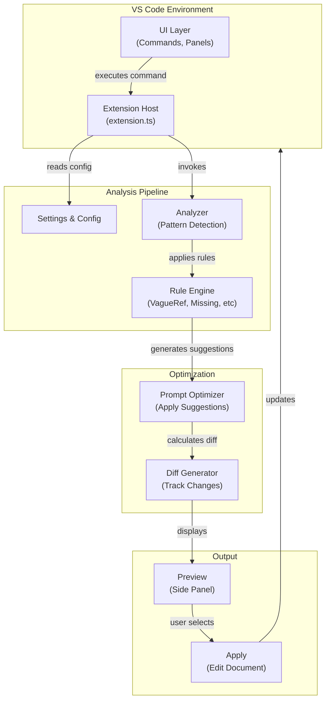

# Architecture Documentation

## System Overview

The Prompt Intelligence Layer is a VS Code extension that provides intelligent analysis and optimization of user prompts. It operates entirely on the client side, ensuring privacy and low latency.

### High-Level Architecture



## Core Components

### 1. Extension Host (`src/extension.ts`)

**Responsibility:** Entry point and command coordination

- Activates on command execution
- Manages UI interactions
- Coordinates analysis pipeline
- Updates editor with results

**Key Methods:**
- `activate()` - Extension initialization
- `executeOptimization()` - Main command handler

---

### 2. Rule System (`src/rules/`)

**Base Class:** `OptimizationRule`

Abstract base class defining the rule interface:

```typescript
abstract class OptimizationRule {
  abstract analyze(prompt: string): RuleResult
  shouldRun(): boolean
}
```

**Concrete Rules:**

| Rule | Purpose | Detection Method |
|------|---------|------------------|
| `VagueReferenceRule` | Detects vague pronouns | Regex matching outside code blocks |
| `MissingContextRule` | Identifies missing context | Pattern analysis |
| `CompoundQuestionRule` | Finds multiple questions | Sentence boundary detection |
| `VerbosePhrasingRule` | Detects verbose expressions | Phrase library matching |
| `InsufficientDetailRule` | Spots lack of detail | Token and entropy analysis |

**Rule Result Structure:**
```typescript
interface RuleResult {
  ruleName: string
  detected: boolean
  suggestions: Suggestion[]
  severity: RuleSeverity
}
```

---

### 3. Analyzer (`src/analyzers/`)

**Responsibility:** Coordinate rule execution and aggregate results

**Pipeline:**
1. Validate prompt (length, encoding)
2. Extract context (code blocks, references)
3. Execute all enabled rules in parallel
4. Aggregate and de-duplicate suggestions
5. Return structured analysis

**Key Methods:**
- `analyze(prompt: string): AnalysisResult`
- `extractCodeBlocks(prompt: string): CodeBlock[]`

---

### 4. Optimizer (`src/optimizer/PromptOptimizer.ts`)

**Responsibility:** Apply suggestions conservatively

**Features:**
- Confidence threshold enforcement (default 0.7)
- Code block preservation
- Conservative behavior (only high-confidence suggestions)
- Change tracking

**Key Methods:**
```typescript
optimize(prompt: string, rules: RuleResult[]): OptimizedPrompt
trackChanges(original: string, optimized: string): ChangeMetrics
getSuggestions(rules: RuleResult[]): Suggestion[]
```

---

### 5. Configuration (`src/config/`)

**Components:**
- `defaultConfig.ts` - Hardcoded defaults
- `Settings.ts` - Workspace configuration reader

**Precedence:**
1. User settings (vscode.workspace.getConfiguration)
2. Default configuration
3. Hardcoded fallbacks

**Key Methods:**
```typescript
getRuleConfig(ruleName: string): RuleConfig
isRuleEnabled(ruleName: string): boolean
getPerformanceTimeout(): number
getConfidenceThreshold(): number
```

---

### 6. UI Layer (`src/ui/`)

**Responsibility:** Manage VS Code UI components

**Components:**
- Command registration
- WebView panels
- Status bar updates
- Error/warning notifications

---

## Data Flow: End-to-End

### Step 1: User Invokes Command

```
User presses Ctrl+Shift+O
  ↓
VS Code triggers "prompt-intelligence-layer.optimizePrompt"
  ↓
Extension's command handler activates
```

### Step 2: Input Validation & Context Extraction

```typescript
const prompt = editor.document.getText()

// Validate
if (prompt.length > maxLength) {
  warn("Prompt too long")
  return
}

// Extract code blocks (preserve during optimization)
const codeBlocks = extractCodeBlocks(prompt)
```

### Step 3: Analysis

```typescript
const analyzer = new Analyzer(settings)
const analysisResult = analyzer.analyze(prompt)

// Internally:
// - Loads enabled rules from config
// - Executes each rule
// - Aggregates suggestions
```

### Step 4: Optimization

```typescript
const optimizer = new PromptOptimizer()
const optimized = optimizer.optimize(prompt, analysisResult)

// Applies only high-confidence (≥0.7) suggestions
// Preserves code blocks
// Tracks changes
```

### Step 5: Preview & Apply

```
Display suggestions in side panel
  ↓
User reviews changes
  ↓
User clicks "Apply"
  ↓
Editor document updated
  ↓
Change tracked in document
```

---

## Performance Considerations

### Target Metrics
- **Per-Rule Analysis:** < 20ms
- **Total Analysis:** < 200ms (configurable)
- **Memory:** < 10MB overhead

### Optimization Strategies

1. **Rule Parallelization**
   - Rules run independently
   - Results aggregated after all complete
   - Consider using Promise.all()

2. **Code Block Detection**
   - Cached regex pattern
   - Preprocessing to exclude from analysis
   - Reduces false positives

3. **Suggestion Caching**
   - Similar prompts reuse cached results
   - Invalidated on rule updates

4. **Lazy Loading**
   - Rules loaded on-demand
   - Settings re-read on workspace change

### Performance Monitoring

```typescript
const start = performance.now()
const result = rule.analyze(prompt)
const duration = performance.now() - start

if (duration > timeout) {
  settings.shouldShowPerformanceWarnings()
    ? showWarning(`Rule ${rule.name} took ${duration}ms`)
    : null
}
```

---

## Extension Points

### Adding a New Rule

1. **Create Rule Class:**
```typescript
// src/rules/NewRule.ts
export class NewRule extends OptimizationRule {
  constructor() {
    super({ name: 'NewRule', ... })
  }
  
  analyze(prompt: string): RuleResult {
    // Implementation
  }
}
```

2. **Register in Rules Index:**
```typescript
// src/rules/index.ts
const RULES = [
  new VagueReferenceRule(),
  new NewRule(),  // Add here
]
```

3. **Add Configuration:**
```json
// package.json contributes.configuration
"promptIntelligence.rules.NewRule.enabled": {
  "type": "boolean",
  "default": true
}
```

### Custom Analyzers

Extend `src/analyzers/` with domain-specific analysis:

```typescript
export class CustomAnalyzer {
  analyze(prompt: string): CustomResult {
    // Specialized logic
  }
}
```

---

## Type System

### Core Types (`src/types.ts`)

```typescript
interface Suggestion {
  message: string
  replacement?: string
  confidence: number
}

enum RuleSeverity {
  info = 'info',
  warning = 'warning',
  error = 'error'
}

interface RuleResult {
  ruleName: string
  detected: boolean
  suggestions: Suggestion[]
  severity: RuleSeverity
}

interface RuleConfig {
  enabled: boolean
  threshold: number
}

interface AnalysisResult {
  prompt: string
  rulesApplied: RuleResult[]
  totalSuggestions: number
}
```

---

## Testing Strategy

### Unit Tests
- **Location:** `test/unit/`
- **Framework:** Mocha + Node.js assert
- **Coverage:** Rule logic, optimizer, config

### Integration Tests
- **Location:** `test/suite/`
- **Framework:** VS Code test harness
- **Coverage:** Command execution, UI, file handling

### Performance Tests
- Included in unit tests
- Verify < 20ms per rule
- Performance job in CI/CD pipeline

---

## Security & Privacy

✅ **No External Calls:** All processing is local

✅ **No Data Transmission:** Prompts never leave the client

✅ **Type Safety:** TypeScript with strict mode

✅ **Input Validation:** All external inputs validated

---

## Design Decisions & Rationale

### Decision 1: Local Processing Only
**Rationale:** Privacy, latency, offline support

### Decision 2: Conservative Optimization
**Rationale:** Avoid over-modification; user retains control

### Decision 3: Rule-Based Architecture
**Rationale:** Modular, extensible, testable

### Decision 4: Code Block Preservation
**Rationale:** Avoid breaking technical content; common in prompt scenarios

### Decision 5: Configuration via VS Code Settings
**Rationale:** Consistency with extension ecosystem, familiar to users

---

## Future Enhancements

- [ ] Machine learning-based suggestion ranking
- [ ] Custom rule creation via UI
- [ ] Prompt templates library
- [ ] Integration with popular LLM APIs for validation
- [ ] Collaborative prompt editing
- [ ] Analytics on improvements
